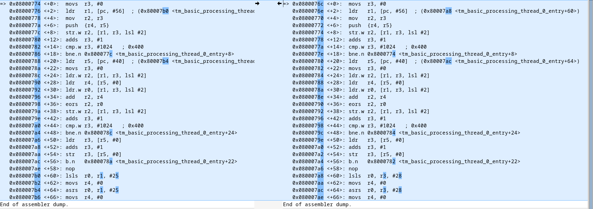

# A strange performance case on Nucleo144 H753zi

## Background

The TM_BASIC test from thread metric is used to validate the performance
benchmarking. This test is OS-agnostic: given the same compiler / compile options, we should give almost the same result ( a variation of +/-2 is normally observed ).

It has been observed that TM_BASIC can give significant performance difference
on some Cortex M7 / ST platforms. This issue is unrelated to the Andy's new 
arch_switch.

The tests below have been conducted on a nucleo144 H753zi. 
Similar issues have been observed on the STM32H750B-DK platform.


## How to reproduce: 

1. Checkout main and apply this patch:
```
diff --git a/tests/benchmarks/thread_metric/prj.conf b/tests/benchmarks/thread_metric/prj.conf
index df5648feb87..0bae6af0d4d 100644
--- a/tests/benchmarks/thread_metric/prj.conf
+++ b/tests/benchmarks/thread_metric/prj.conf
@@ -26,3 +26,10 @@ CONFIG_THREAD_LOCAL_STORAGE=n
 
 # Disable memory slab pointer validation
 CONFIG_MEM_SLAB_POINTER_VALIDATE=n
+
+
+# Turn off MPU explicitly, as some platforms enable it even when
+# unused, and it impacts performance paths needlessly (on arm, ARM_MPU
+# appears to select MPU, so you need to hit both)
+CONFIG_MPU=n
+CONFIG_ARM_MPU=n
diff --git a/tests/benchmarks/thread_metric/src/tm_api.h b/tests/benchmarks/thread_metric/src/tm_api.h
index b11a182b24b..94a9dd70beb 100644
--- a/tests/benchmarks/thread_metric/src/tm_api.h
+++ b/tests/benchmarks/thread_metric/src/tm_api.h
@@ -68,7 +68,7 @@ extern "C" {
 /* Define the time interval in seconds. This can be changed with a -D compiler option.  */
 
 #ifndef TM_TEST_DURATION
-#define TM_TEST_DURATION 30
+#define TM_TEST_DURATION 10
 #endif
 
 /*
``` 

2. Build thread metric TM_BASIC benchmark 
```
west -v build -d build_h753zi -p -b nucleo_h753zi/stm32h753xx ../zephyr/tests/benchmarks/thread_metric -- -DCONFIG_TM_BASIC=y  | tee h7.build_log.txt
```
3. Same, but with the option `CONFIG_THREAD_STACK_INFO=y`:
```
west -v build -d build_h753zi_tsi -p -b nucleo_h753zi/stm32h753xx ../zephyr/tests/benchmarks/thread_metric -- -DCONFIG_TM_BASIC=y -DCONFIG_THREAD_STACK_INFO=y | tee h7tsi.build_log.txt
```
4. Check result for both builds (with and without THREAD_STACK_INFO):
```
cd build_h753zi
west flash
minicom -D /dev/ttyACM0
**** Thread-Metric Basic Single Thread Processing Test **** Relative Time: 10
Time Period Total:  123731

**** Thread-Metric Basic Single Thread Processing Test **** Relative Time: 20
Time Period Total:  123992

**** Thread-Metric Basic Single Thread Processing Test **** Relative Time: 30
Time Period Total:  123988
```
```
cd ../build_h753zi_tsi
west flash
minicom -D /dev/ttyACM0 --color=on 

**** Thread-Metric Basic Single Thread Processing Test **** Relative Time: 10
Time Period Total:  148315

**** Thread-Metric Basic Single Thread Processing Test **** Relative Time: 20
Time Period Total:  148262

**** Thread-Metric Basic Single Thread Processing Test **** Relative Time: 30
Time Period Total:  148247
```
**Observations:** the version with "THREAD_STACK_INFO" is about ~20% faster!! 

## Another weierdness: 

In the "fast version", if we add the following line before initializing 
the test array:
```
tm_basic_processing_counter +=1;
```
then the performance again drops again, even though it's only one 
more operation in addition to the million we're already doing.
```
**** Thread-Metric Basic Single Thread Processing Test **** Relative Time: 10
Time Period Total:  126707

**** Thread-Metric Basic Single Thread Processing Test **** Relative Time: 20
Time Period Total:  126659

**** Thread-Metric Basic Single Thread Processing Test **** Relative Time: 30
Time Period Total:  126647
```

## Some basic checkings:

- The only option that differs is CONFIG_THREAD_STACK_INFO:
```
diff build_h753zi/zephyr/include/generated/zephyr/autoconf.h build_h753zi_tsi/zephyr/include/generated/zephyr/autoconf.h
231a232
> #define CONFIG_THREAD_STACK_INFO 1
```

- Almost all the time is spent in  tm_basic_processing_thread_0_entry

- Up to the changes in address for the counter/array variable and function code,
the assembly code in both version (without/with THREAD_STACK_INFO) is identical. 


**Notes:** A literal pool is stored at offset +0x60, which contains the address of tm_basic_processing_counter and tm_basic_processing_array respectively.

# what could be the issue

- [ ] bug in the build system, like different compile option. Unlikely, as assemblly code is the same.
- [ ] bug in TM_BASIC
- [ ] others???

